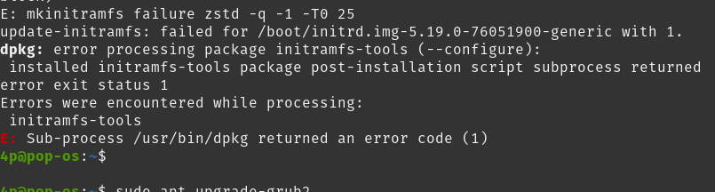
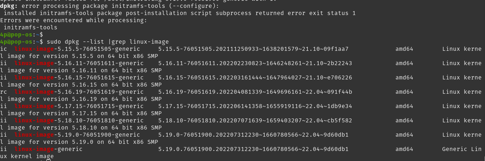
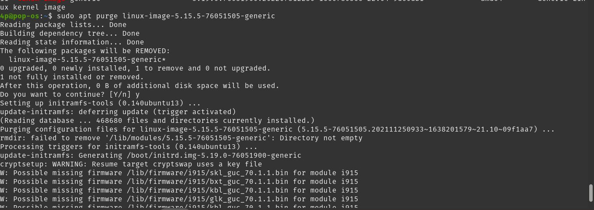
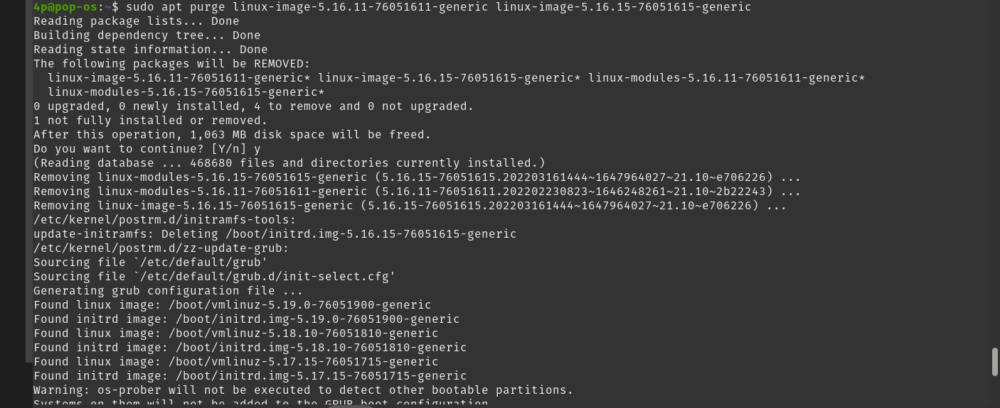
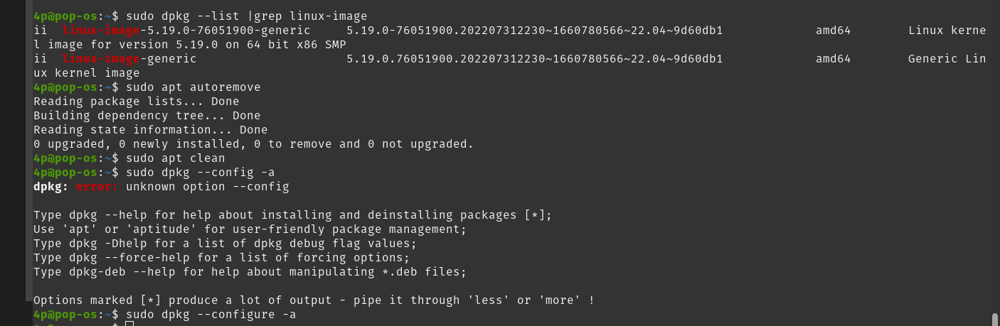
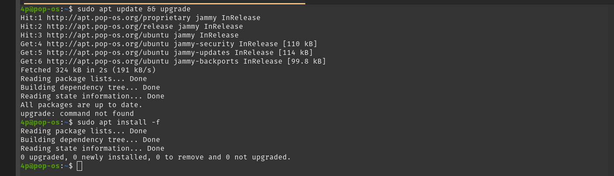

## Solicionar Errores linux
### Error dpkg
Recomendacion en caso de no tener instalado unicode, debes de hacerlo:

SO Linux pop-os 5.19.0-76051900-generic

Al tratar de actualizar nos arroja un error

Lo que procede es ejecutar el siguiente comando
sudo dpkg --list |grep linux-image
El cual nos lista de las actualizaciones del SO y tenemos que eliminar los anteriores 

En este primer ejemplo tenemos que eliminar el primero en la lista
sudo apt purge linux-image-5.15.5-76051505-generic

También podemos eliminarlos todos de la siguiente manera:
sudo apt purge linux-image-5.15.5-76051505-generic linux-image-5.16.11-76051611-generic linux-image-5.16.15-76051605-generic linux-image-5.16.19-76051619-generic linux-image-5.17.15-76051715-generic linux-image-5.18.10-76051810-generic 

luego volvemos a revisar la lista

sudo dpkg --list |grep linux-image 

después realizamos lo siguiente:
sudo apt autoremove
sudo apt clean 
sudo dpkg --configure -a <- ya no tiene que arrojar ningún mensaje

Por último podemos revisar con una actualización e instalación

sudo apt update && upgrade

sudo apt install -f

